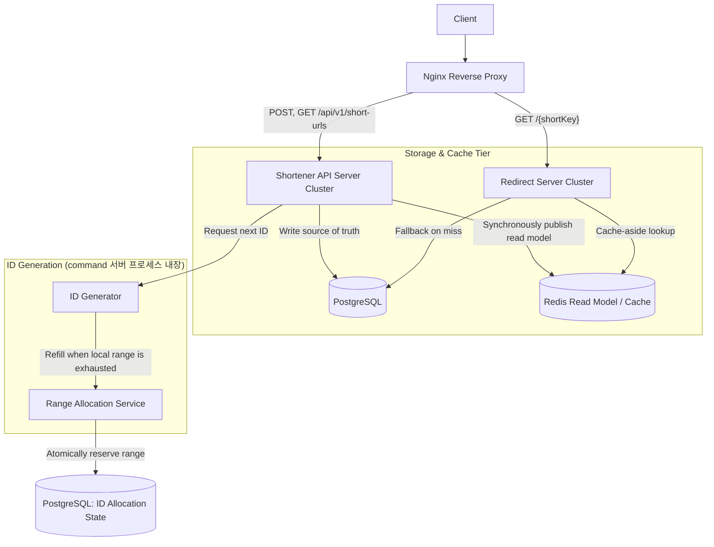

# Tiny URL Shortener 설계

[프로젝트 README](../README.md)

『요즘 개발자들을 위한 시스템 설계 수업』 9장의 요구사항을 참고하되,
이 저장소에서 직접 선택한 설계 결정과 구현 계약을 기록한다.

## 요구사항

### MVP

- 긴 URL을 입력받아 고유한 7자 단축 키를 생성한다.
- 단축 키는 Base62 문자 집합(`0-9`, `A-Z`, `a-z`)을 사용한다.
- 단축 키를 입력받아 원본 URL을 반환한다.
- 입력받은 URL이 유효한 HTTP 또는 HTTPS URL인지 검사한다.
- URL을 정규화한 후 동일한 URL인지 판단한다.
- 사용자와 관계없이 동일한 긴 URL을 요청하면 기존 단축 키를 공유한다.
- 존재하지 않는 단축 키와 잘못된 요청에 적절한 오류를 반환한다.
- 단축 URL 요청을 `307 Temporary Redirect`로 원본 URL에 리다이렉트한다.
- `user_id`를 기준으로 URL 생성자와 URL 소유권을 관리한다.

### 추후 지원

- 사용자가 원하는 맞춤형 단축 키를 생성한다.
- 마지막 사용 시점으로부터 6개월이 지난 단축 URL을 만료시키고,
  조회 시 `410 Gone`을 반환한다.
- URL 생성자가 원본 URL을 수정하거나 URL 매핑을 삭제한다.
- 단축 URL의 사용량을 분석하고 모니터링한다.

## 비기능적 요구사항

- 사용자 1억 명 규모와 갑작스러운 요청 증가에 대응할 수 있어야 한다.
- 읽기 요청이 쓰기 요청보다 많은 서비스를 가정한다.
- URL 조회 응답 시간은 p95 기준 100ms 이하를 목표로 한다.
- 동일한 단축 키에는 항상 동일한 원본 URL을 반환해야 한다.
- 시스템 장애가 발생해도 저장된 URL 매핑을 안전하게 유지해야 한다.

구체적인 일일 활성 사용자 수, URL 생성량, 초당 조회량은 용량 산정 단계에서
추가로 정의한다.

## 계산으로 문제 규모 파악

> 책의 규모 산정 과정을 재현하기 위해 필드 크기는 책에서 제시한 값을 사용하며,
> 데이터베이스 행·인덱스·자료형 오버헤드는 제외한다.

### 가정

- 일일 활성 사용자 수(DAU): 1억명
- 사용자당 일일 URL 생성 횟수: 1회
- 읽기와 쓰기 비율: 100:1
- URL 매핑 보관 기간: 10년 (3,650일)
- URL 매핑 하나의 평균 크기: 1,060 Byte (20B + 1000B + 10B + 10B + 20B)
  - 단축 URL: 20B
  - 원본 URL: 1,000B
  - created_at : 10B
  - updated_at: 10B
  - created_by: 20B

### 트래픽

- 일일 URL 생성량: 1억 건
- 평균 쓰기 QPS: 1,158 QPS
- 최대 쓰기 QPS: 2,316 QPS (최대 트래픽은 평균의 2배)
- 평균 읽기 QPS: 115,800 QPS
- 최대 읽기 QPS: 231,600 QPS (최대 트래픽은 평균 읽기의 2배)

### 저장 공간

- 일일 저장량: 106 GB / 일
- 전체 보관 기간의 저장량: 386.9 TB
- 복제본을 포함한 저장량: 1,160.7 TB (Replication Factor = 3)

### 네트워크 대역폭
(payload 1,060B 및 프로토콜 오버헤드 제외)
- 인바운드 대역폭: 9.82 Mbps
- 아웃바운드 대역폭: 981.47 Mbps

### 메모리 및 캐시

- 캐시 대상과 기간: 상위 20% Hot URL 데이터 / 1일간 유지 (파레토 80/20 법칙 적용)
- 목표 캐시 적중률: 80% 이상
- 캐시에 필요한 메모리: 21.2 GB (고유 URL 수 × 20% × 엔트리 크기)

## Domain/Service 계층 계약

Domain과 Service 계층은 `Ab12Cd3`과 같은 `shortKey`만 반환한다.
Controller(API) 계층은 Service가 반환한 키에 기본 도메인을 붙여
`https://tiny.url/Ab12Cd3`과 같은 완성된 단축 URL을 생성한다.

Domain과 Service 계층에서 발생하는 오류는 도메인 전용 sentinel error로
정의한다. 예를 들어 URL 매핑을 찾을 수 없을 때는 `nil`이 아니라
`ErrURLMappingNotFound`를 반환한다.

```go
var (
	ErrInvalidUserID       = errors.New("invalid user id")
	ErrInvalidURL          = errors.New("invalid url")
	ErrURLMappingNotFound  = errors.New("url mapping not found")
	ErrURLMappingExpired   = errors.New("url mapping expired")
	ErrShortURLConflict    = errors.New("short URL already exists")
	ErrKeyGenerationFailed = errors.New("short key generation failed")
)
```

호출자는 `errors.Is`로 오류를 구분한다. Controller(API) 계층은 `ErrInvalidUserID`와
`ErrInvalidURL`을 `400 Bad Request`로, `ErrURLMappingNotFound`를
`404 Not Found`로, `ErrURLMappingExpired`를 `410 Gone`으로,
`ErrKeyGenerationFailed`를 `500 Internal Server Error`로 변환한다.

Base62 단축 키가 기존 키와 충돌하면 최초 시도 후 새 키 생성을
최대 3회 재시도한다. 3회의 재시도가 모두 실패하면 도메인 전용 오류인
`ErrKeyGenerationFailed`를 반환한다.

## URL 정규화

중복 URL을 조회하거나 새 매핑을 저장하기 전에 다음 규칙을 적용한다.

- 입력값의 앞뒤 공백을 제거한다.
- scheme과 host를 소문자로 변환한다.
- HTTP의 기본 포트 `80`과 HTTPS의 기본 포트 `443`을 제거한다.
- 빈 path를 `/`로 변환한다.
- path와 query parameter는 원래 값을 보존한다.

따라서 `HTTPS://EXAMPLE.COM:443`과 `https://example.com/`은 동일한 URL로
취급한다.

## API 계약

### URL 단축

`POST /api/v1/short-urls`

요청:

```json
{
  "user_id": "user_123",
  "url": "https://example.com/very/long/path"
}
```

신규 단축 키를 생성하면 `201 Created`를 반환한다. 기존 URL 매핑을
재사용하면 동일한 응답 본문과 함께 `200 OK`를 반환한다.
신규 생성 응답의 `Location` 헤더는 `/api/v1/short-urls/{shortKey}`를 가리킨다.

응답 본문:

```json
{
  "short_key": "Ab12Cd3",
  "short_url": "https://tiny.url/Ab12Cd3",
  "long_url": "https://example.com/very/long/path"
}
```

잘못된 URL을 전달하면 `400 Bad Request`를 반환한다.

### 관리용 매핑 조회

`GET /api/v1/short-urls/{shortKey}`

성공하면 생성 API와 같은 매핑 정보를 `200 OK` JSON으로 반환한다. 관리 조회는
공개 링크 방문 횟수와 마지막 접근 시각을 갱신하지 않는다. 단축 키가 존재하지
않으면 `404 Not Found`, 만료됐다면 `410 Gone`을 반환한다.

### 공개 리다이렉트

`GET /{shortKey}`

성공 응답 (`307 Temporary Redirect`):

```http
HTTP/1.1 307 Temporary Redirect
Location: https://example.com/very/long/path
```

단축 키가 존재하지 않으면 `404 Not Found`를, 단축 URL이 만료됐다면 `410 Gone`을
반환한다. API 경로와 응답에 대한 결정은
[ADR 07. 공개 리다이렉트 경로와 관리 API를 분리한다](decisions/07-define-public-api-paths-and-responses.md)에
기록한다.

## 아키텍처



초기 구현에서는 하나의 서버 프로세스가 Command API와 Redirect 요청을 모두
처리한다. 이 구성은 `SERVER_ROLE=all`로 실행한다.

운영 구성에서는 애플리케이션 바이너리는 같지만 `SERVER_ROLE=command`와
`SERVER_ROLE=redirect`를 서로 다른 프로세스로 실행한다. Command 역할은 생성 및
관리 조회 API를, Redirect 역할은 공개 리다이렉트만 노출한다. 따라서 공개 링크
트래픽 증가나 장애가
URL 생성 용량과 배포에 직접 영향을 주지 않으며 각 역할을 독립적으로 확장할 수
있다. 초기 단일 서버 구성은 로컬 개발에서도 사용할 수 있지만 운영 Compose에서는
사용하지 않는다.

현재 단계에서는 PostgreSQL을 양쪽의 source of truth로 공유하고 Redis를 분리된
읽기 모델로 사용한다. 생성 요청은 PostgreSQL commit 이후 Redis를 동기 갱신해
생성 직후의 불일치 구간을 줄인다. Redis miss 또는 장애 시 Redirect 서버는
PostgreSQL로 fallback한다. 캐시 갱신 순간에 Redis가 실패하면 기존 negative cache의
TTL(기본 30초) 동안 새 매핑이 보이지 않을 수 있으며, 엄격한 read-your-write가
필요해지면 outbox/CDC와 생성 확인 절차를 추가한다.

Redis는 PostgreSQL을 직접 조회하지 않는다. 애플리케이션이 Redis를 먼저 조회하고,
cache miss이면 PostgreSQL에서 URL 매핑을 읽은 뒤 Redis를 채우는 cache-aside
방식을 사용한다.

애플리케이션은 URL을 생성할 때 ID Generator에 ID 하나를 요청한다. 각 ID Generator
인스턴스는 자신이 할당받은 범위 안에서 로컬 카운터를 증가시킨다. 현재 범위를
모두 사용했을 때만 Range Allocation Service에 새로운 범위를 요청한다.

Range Allocation Service는 PostgreSQL의 ID allocation state를 transaction으로
갱신해 서로 겹치지 않는 범위를 할당한다. 초기 구현에서는 URL 매핑과 같은
PostgreSQL 클러스터의 논리적으로 분리된 테이블을 사용한다.

ID Generator와 Range Allocation Service는 초기 구현에서 별도 프로세스가 아니라
command 서버 안의 컴포넌트다. 따라서 ID Generator 인스턴스는 command 서버
인스턴스와 1:1로 대응하고 범위는 프로세스마다 독립적이며, 실제로 분리된 것은
PostgreSQL의 ID allocation state뿐이다. Redirect 역할은 ID를 발급하지 않으므로
ID Generator를 만들지 않는다. 범위 크기는 `ID_RANGE_SIZE` 설정값으로 조정한다.

구체적인 선택과 장애 처리 정책은
[ADR 03. 분산 카운터로 단축 URL ID를 생성한다](decisions/03-use-distributed-counter-for-url-ids.md)에
기록한다.
